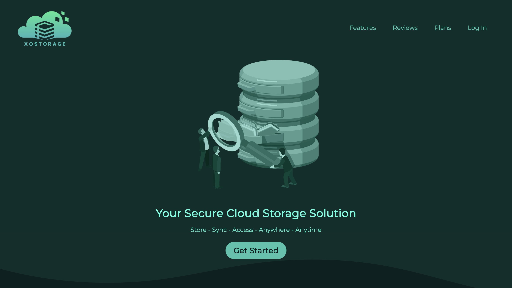
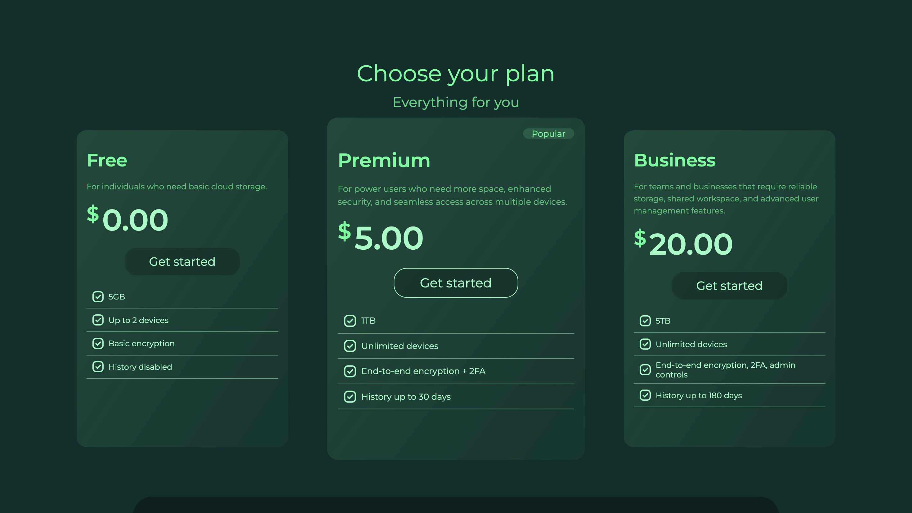
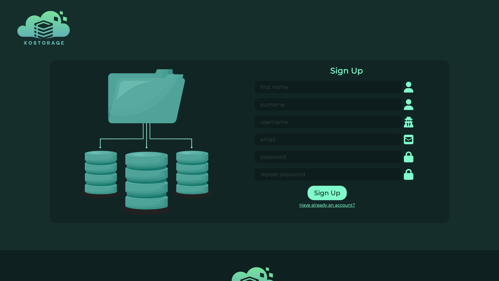
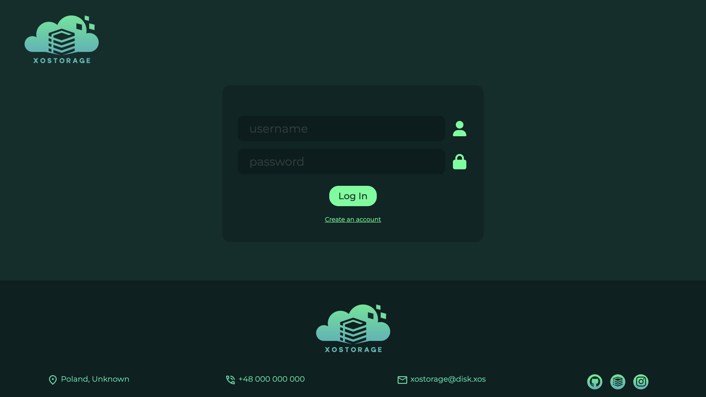
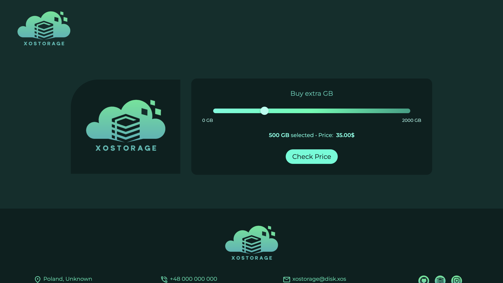

# 🚀 Xostorage

**Xostorage** is a modern, responsive landing page for a cloud storage company. Inspired by services like Google Drive, this static site is a sleek presentation of a fictional online disk platform.

🌐 [Live demo](https://xostorage.vercel.app/)

---

## ✨ Features

- ⚡ Responsive design across all screen sizes  
- 🔗 Smooth anchor navigation  
- 🔐 Login and registration pages with:
  - Form validation  
  - Credential checking (demo credentials below)  
- 💬 Review carousel  
- 📦 User plan pricing section  
- 🎨 Google Fonts & Font Awesome integration
- 💸 Progress Bar for checking price of GBs

---

## 🔑 Demo Login

To explore the login system, use the following demo credentials:

Login: xostorage
Password: admin123

---

## 🖼️ Screenshots

### 🏠 Homepage  

### 📦 Plans Section  

### 💬 Reigster Page 

### 🔐 Login Page  

### 🔐 Checking price of GBs 

---

## 🛠️ Built With

- HTML5  
- CSS3  
- JavaScript  
- [Google Fonts](https://fonts.google.com/)  
- [Font Awesome](https://fontawesome.com/)  

---

## 📁 Getting Started

To run the project locally:

1. Clone the repository  
2. Open `index.html` in your browser

No additional dependencies or installations required.

---

## 🚧 Project Status

Beta version complete — visually and functionally ready.

---

## 👤 Author

**xostrch**  
🔗 [GitHub](https://github.com/xostrch)

---

## 📌 Notes

- This is a static presentation project — no actual cloud file storage is implemented.
- No license is applied.

---

## 🧭 Navigation

- [Live Demo](https://xostorage.vercel.app/)
- [Login Page](https://xostorage.vercel.app/login.html)
- [Register Page](https://xostorage.vercel.app/register.html)
